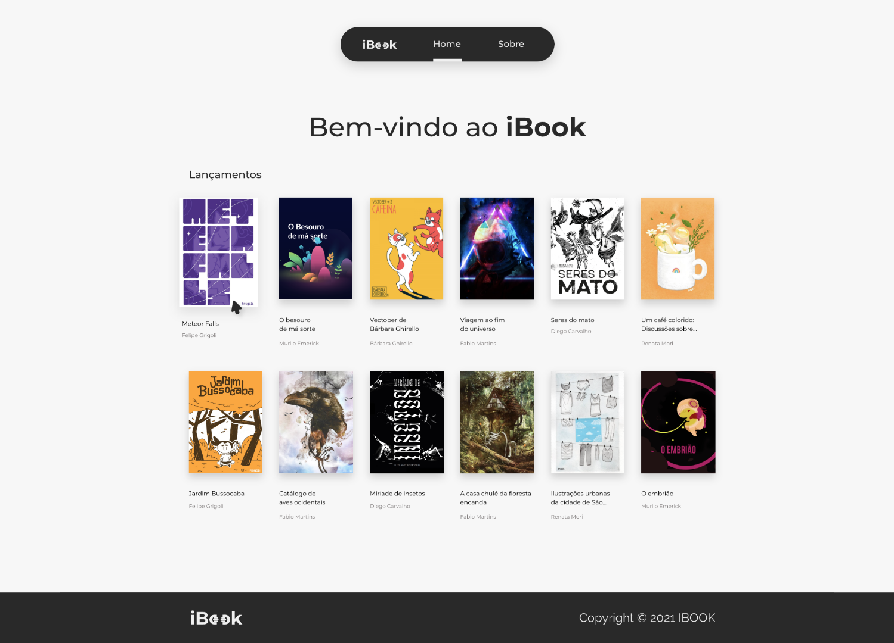

<div align="center" id="top"> 
  

  &#xa0;

  <!-- <a href="https://ibook.netlify.app">Demo</a> -->
</div>

<h1 align="center">Ibook</h1>

<p align="center">
  <!--  -->

  <!--  -->

  <!--  -->
</p>

<!-- Status -->

<!-- <h4 align="center"> 
	🚧  Ibook 🚀 Under construction...  🚧
</h4> 

<hr> -->

<p align="center">
  <a href="#dart-about">About</a> &#xa0; | &#xa0; 
  <a href="#sparkles-features">Features</a> &#xa0; | &#xa0;
  <a href="#rocket-technologies">Technologies</a> &#xa0; | &#xa0;
  <a href="#white_check_mark-requirements">Requirements</a> &#xa0; | &#xa0;
  <a href="#checkered_flag-starting">Starting</a> &#xa0; | &#xa0;
  <a href="#memo-license">License</a> &#xa0; | &#xa0;
  <a href="https://github.com/{{YOUR_GITHUB_USERNAME}}" target="_blank">Author</a>
</p>

<br>

## :dart: About ##

Application for reading books

## :rocket: Technologies ##

The following tools were used in this project:

- [Node.js](https://nodejs.org/en/)
- [Nuxt](https://nuxtjs.org/)
- [TypeScript](https://www.typescriptlang.org/)

## :white_check_mark: Requirements ##

Before starting :checkered_flag:, you need to have [Git](https://git-scm.com) and [Node](https://nodejs.org/en/) installed.

## :checkered_flag: Starting ##

```bash
# Clone this project
$ git clone https://github.com/gabrieljcf/ibook

# Access
$ cd ibook

# Install dependencies
$ yarn

# Run the project
$ yarn dev

# The server will initialize in the <http://localhost:3000>
```

## :memo: License ##

This project is under license from MIT. For more details, see the [LICENSE](LICENSE.md) file.


Made with :heart: by <a href="https://github.com/gabrieljcf" target="_blank">Gabriel Nogueira</a>

&#xa0;

<a href="#top">Back to top</a>
